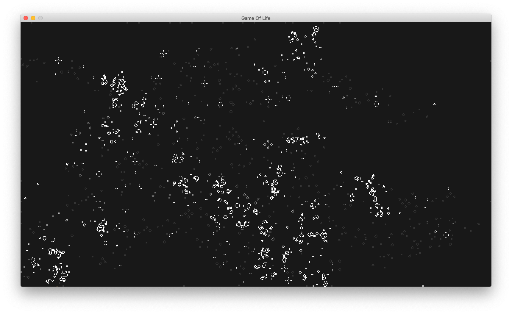

# Conway's Game Of Life

This is an implementation of [John Conway's Game Of Life](https://en.wikipedia.org/wiki/Conway%27s_Game_of_Life) in the Rust programming language.

This program is a port of [this Haskell program](https://github.com/tkoster/gameoflife-hs).

The generations are animated at 120 frames per second.

## Getting Started

**Prerequisites**

- [Cargo](https://doc.rust-lang.org/stable/cargo/) was used to build this project.
- [SDL2](https://www.libsdl.org/) was used (via these [bindings](https://crates.io/crates/sdl2)) for window management, input and rendering.

Run `cargo build --release` to compile the source code.

To run the program from this directory, run `cargo run --release`.

## Input bindings

Click the **left mouse button** to place a pattern where you clicked.

Click and drag the **right mouse button** to continuously place patterns as you drag the mouse.

Press the numbers **1**, **2** or **3** to change the selected pattern from presets.

Press **R** to rotate the selected pattern 90 degrees counterclockwise.

Press **P** to pause and unpause the evolution of the generations.

Press **Escape** to quit.

